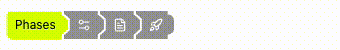

# react-monorail [](https://www.npmjs.com/package/react-monorail)



A segmented, overlapping rail of expandable cars for React. The active car grows to show its content; inactive cars collapse to an icon or a sliver. Hover previews a collapsed car without committing to it.

Monorail is for compact step indicators, phase selectors, and status strips where several items share one row and only one (or none) should take up space.

## Demo

Try it on [CodeSandbox](https://codesandbox.io/p/devbox/peaceful-lovelace-n8jwdg?workspaceId=ws_Rny9Pbwfw8iG8u12AY1WKy).

## Installing

```bash
yarn add react-monorail
```

or

```bash
npm install --save react-monorail
```

Peer dependencies: `react` and `react-dom`.

## Basic Example

`MonorailCar` children must be **direct** children of `Monorail`. Do not wrap a car in another component; `Monorail` clones each child to inject index and theme props.

Each car’s `children` is a render function. It receives `{ isActive, isHovered, isOtherHovered }` so you can show or hide labels. Cars also set `data-active` and `data-hovered` for CSS.

```js
import { Monorail, MonorailCar } from "react-monorail";

export default () => (
  <Monorail>
    <MonorailCar>{() => "Research"}</MonorailCar>
    <MonorailCar>
      {(itemState) => (itemState.isActive || itemState.isHovered) && "Design"}
    </MonorailCar>
    <MonorailCar>{() => "Launch"}</MonorailCar>
  </Monorail>
);
```

```bash
npm install
npm run dev
```

Open the URL Vite prints (default `http://localhost:5173`). The gallery covers hover-to-reveal, icons, controlled mode, CSS height, status-only rails, and CSS theming.

## API

## Components

react-monorail consists of 2 components which need to be used together.

### &lt;Monorail /&gt;

The rail container. It provides per-rail selection and hover state and clones each `MonorailCar` child to inject `index`, `totalItems`, and control props.

#### children: `ReactElement<MonorailCarProps> | (ReactElement<MonorailCarProps> | null)[]`

Direct `MonorailCar` children. Nested wrappers around a car will not receive injected props.

#### className: `string`

> default: `"monorail"`

Extra classes on the rail container. Override `--monorail-*` tokens here.

#### style: `CSSProperties`

> default: `undefined`

Inline styles on the rail container. Useful for setting `--monorail-*` CSS variables.

#### initialActiveIndex: `number`

> default: `0`

This allows changing the car that should be active on initial render. This is a zero-based index, so first car is `0`, second car is `1`, ...

> This can only be used in uncontrolled mode when react-monorail handles the current selected car internally and for this reason cannot be used together with `activeIndex`. See [here](#controlled-vs-uncontrolled-mode) for more info on modes.

#### activeIndex: `number`

> default: `undefined`

Set the currently selected car. This is a zero-based index, so first car is `0`, second car is `1`, ... Pass `-1` for none selected.

This enables controlled mode. See [here](#controlled-vs-uncontrolled-mode) for more info on modes.

#### onActiveIndexChange: `(index: number) => void`

> default: `undefined`

This event handler is called every time the active car changes in uncontrolled mode.

> In controlled mode, selection is updated from the parent. Use each car’s `onClick` instead of this handler.

#### disableTransitions: `boolean`

> default: `false`

Snap width changes instead of animating. This option can also be set directly on an individual `<MonorailCar />`.

### &lt;MonorailCar /&gt;

An individual car in the rail. By default it renders a `<button type="button" />`; set `isButton={false}` to render a `<div />`.

`index`, `totalItems`, `activeIndex`, and `onActiveIndexChange` are injected by `<Monorail />`. You do not need to set them unless you are doing something unusual.

#### children: `(state: { isActive: boolean; isHovered: boolean; isOtherHovered: boolean }) => ReactNode`

A render function that receives the car’s current state. Return the label or content to show inside the car. Returning `null` or `false` collapses the label while keeping the icon (if any) visible.

#### icon: `ReactNode`

> default: `undefined`

Optional leading icon. Stays visible when the label collapses so collapsed cars still have a hit target.

#### className: `string`

> default: `undefined`

Extra classes on the car element. Override height (`h-[38px]`), type size (`text-sm`), and `--monorail-*` tokens here. Default height is `28px` with `0.75rem` type.

#### style: `CSSProperties`

> default: `undefined`

Inline styles on the car element.

#### isButton: `boolean`

> default: `true`

When `false`, renders a `div` instead of a `button`. Use this for display-only status cars, not for selectable cars.

#### isActive: `boolean`

> default: `false`

Force this car active. ORed with the rail’s active index, so a car can appear active even when it is not the selected index.

#### hasHoverEffect: `boolean`

> default: `false`

Apply the active background while this car is hovered, without selecting it.

#### onClick: `(index: number) => void`

> default: `undefined`

Called when the car is clicked in controlled mode. The parent should update `activeIndex` from this handler. Cars with `isButton={false}` do not fire `onClick`.

> In uncontrolled mode the rail updates selection internally and calls `onActiveIndexChange` on `<Monorail />` instead. `onClick` is not called.

#### disableTransitions: `boolean`

> default: inherited from `<Monorail />`

Override the rail transition setting for this car.

#### activeClassName: `string`

> default: `undefined`

Extra classes when the car is active or hover-highlighted (`hasHoverEffect`).

#### contentClassName: `string`

> default: `undefined`

Classes on the animated width wrapper.

#### iconClassName: `string`

> default: `undefined`

Classes on the icon wrapper.

#### childrenWrapperClassName: `string`

> default: `undefined`

Classes on the label wrapper. You can also hide labels with CSS, for example `[[data-active=false][data-hovered=false]_&]:hidden`.

## Controlled vs Uncontrolled mode

react-monorail has two different modes it can operate in, which change how much you need to take care of the state yourself.

### Uncontrolled mode

This is the default mode and makes the monorail handle its state internally. You can change the starting car with `initialActiveIndex` and you can listen for changes with `onActiveIndexChange`.

```js
<Monorail initialActiveIndex={1} onActiveIndexChange={(index) => console.log(index)}>
  <MonorailCar>{() => "Title 1"}</MonorailCar>
  <MonorailCar>{() => "Title 2"}</MonorailCar>
</Monorail>
```

### Controlled mode

This mode has to be enabled by supplying `activeIndex` to the `<Monorail />` component.

In this mode react-monorail does not handle any car selection internally and leaves all the state management up to the outer application. Pass `onClick` on cars that should change the selection. Cars with `isButton={false}` are display-only. Pass `activeIndex={-1}` for none selected.

`initialActiveIndex` does not have any effect in this mode.

```js
const App = () => {
  const [activeIndex, setActiveIndex] = useState(0);

  return (
    <Monorail activeIndex={activeIndex}>
      <MonorailCar onClick={setActiveIndex}>{() => "Title 1"}</MonorailCar>
      <MonorailCar onClick={setActiveIndex}>{() => "Title 2"}</MonorailCar>
    </Monorail>
  );
};
```

## Styling

Styles ship with the component. Importing `Monorail` loads the stylesheet (including [augmented-ui](https://augmented-ui.com/) clip shapes) — no extra CSS import or Tailwind setup is required.

You can still pass `className` from your own CSS or Tailwind (`h-[38px]`, `text-sm`, …).

### CSS variables

Tokens are hex, `rgb()`, or `rgba()` color values:

| Token | Default | Role |
| --- | --- | --- |
| `--monorail-bg` | `#9c9c9c` | Inactive car background |
| `--monorail-text` | `#ffffff` | Inactive car text |
| `--monorail-active-bg` | `#daff00` | Active car background |
| `--monorail-active-text` | `#000000` | Active car text |
| `--monorail-car-height` | `28px` | Car height |
| `--monorail-car-font-size` | `0.75rem` | Car type size |
| `--monorail-car-line-height` | `1rem` | Car line height |

Override them on the rail or a car:

```js
<Monorail
  style={
    {
      "--monorail-active-bg": "#33b0ff",
      "--monorail-text": "#daff00",
    } as CSSProperties
  }
>
  <MonorailCar>{() => "Override"}</MonorailCar>
  <MonorailCar>{() => "Active"}</MonorailCar>
</Monorail>
```

### Size

Default car height is `28px` with `0.75rem` type. Override with `className` on each car (`h-[38px] text-sm`, `h-[50px]`, …) or with `--monorail-car-height` / `--monorail-car-font-size`. Right-side clip insets scale from the measured height.

### Custom content

Use the render function and `className` / `icon` / `activeClassName` to vary a car’s content and look. See `demo/Gallery.tsx` for hover-to-reveal, icons, status-only rails, and trailing actions.

## Accessibility

- Cars default to `<button type="button">`, so they are in the tab order and activate with Enter and Space.
- `isButton={false}` renders a non-interactive `div`. Use it only for status/display rails, not for selectable cars.
- There is no `role="tablist"` / `aria-pressed` / roving tabindex today. If you need a tab or radio pattern, wrap the rail and set ARIA on your own labels, or treat the default buttons as a toolbar of actions.
- Focus styles are not bundled; the demo adds `:focus-visible` outlines. Add an equivalent in the host app.

## Development

```bash
npm install
npm run dev      # Vite gallery
npm test         # Vitest
npm run lint     # Biome + tsc
npm run build    # ESM + types via tsup
```

`npm run format` applies Biome fixes.

## License

MIT
